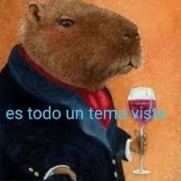

Cómo prácticamente el 99.9% de los seres humanos, mi trayectoria se encuentra formada sobre una amplia y basta colección de fracasos, tropiezos y caidas que me han ayudado (algunos más que otros) a llegar a ser quién soy hoy. \
Este es capaz el que yo considero el más rotundo fracaso dentro de todos esos fracasos que antes les comentaba, que me abrió mucho la cabeza cómo desarrollador, y me hizo darme cuenta de que definir el alcance y los lineamientos de un proyecto es aún más importante que el proyecto en sí.

Si leyeron mi anterior (y primer) blogpost, se habrán podido dar cuenta de que soy una persona a la que siempre le gusta complicarse un poquito más la vida. \
Adoro los desafíos, adoro programar, y adoro las competencias que me llevan al límite (haciéndome odiar todo lo antes mencionado xD). \
Soy de esos a los que las **IPM** (**I**deas **p**or **M**inuto, sí, me lo acabé de inventar) le llueven. Eso NO quiere decir que todas sean buenas, o que sean sólidas, ni mucho menos. \
A veces (el 95% de las veces) sólo son una mezcla tipo _cocktail_ entre ansiedad, falta de sueño, y café, mucho pero mucho café.\
El verdadero problema es aprender a diferenciarlas, aprender a separar las ideas buenas, de las malas, las potables, de las no potables, las viables de las psicóticamente descabelladas. \
Y el verdadero segundo problema, es hacerlo a tiempo.

De eso se va a tratar en resumidas cuentas este post, de cómo arrastré a mis amigos a una hackatón de 48hs con un cúmulo propio de ideas poco potables que aún así fuí capaz de transmitirle a mis amigos, por lo visto con la suficiente convicción cómo para hundirnos a todos en la misma locura.

Pero, como siempre, antes de arrancar, vamos a presentar a...

## El Equipo

Cómo ya saben (y si no lo saben se los comento) no soy una persona "seria" cómo la gente suele decir, y eso se nota mucho en los nombres de los equipos que conformo. \
Cómo todos los benditos nombres de cosas en mi vida, no se buscó ni se encontró, nació (de pedo) con el pasar de las cosas. \
Mientras que con Rami y Ariel estábamos proponiendo ideas en el grupo de WhatsApp, Román, el nuevo 4to integrante de nuestro drimtim (_"Equipo Soñado"_ para los que no sepan inglés) mandó un sticker, más concretamente este sticker:

Y así mágicamente, un poco por joder, un poco por la moda de los carpinchos y otro poco porque sí, llegó el nombre "Y... es todo un tema viste." (Leído tal cual cómo se escribió, con puntos suspensivos y todo).

Cómo dato curioso, Gemini define esta frase de la siguiente manera:
> "Es todo un tema, viste" es una expresión coloquial rioplatense (usada en Argentina y Uruguay) que significa que algo es un problema, una cuestión complicada o difícil de tratar.
> La frase implica que el tema en cuestión es complejo y requiere de cierta atención o consideración

que irónicamente, es justo de lo que pecamos; falta de atención y consideración, que más adelante íbamos a pagar bien caro.

### El Cuarto Integrante

Ya presenté a Rami y Ariel en mi post anterior (sí no lo leyeron vayan a leerlo plis). \
En esta mini sección voy a presentar al nuevo cuarto integrante que tuvo la suerte (o desgracia) de conocerme y ser arrastrado a estas "neerdeadas" que tanto me encantan :D \
Román o Roman como a veces le digo (porque tengo hermosos recuerdos del GTA IV que no pienso soltar) es un (ahora ex) compañero de trabajo, amigo del alma, con el que tuve la suerte de encontrarme en uno de esos proyectos en dónde o sale todo muy mal, o todo hermosamente bien. Dicho de otra forma, nos conocimos en una migración tecnológica/refactorización de una API recontra-mega-legacy, con deadlines acotadas. \
Para mi sorpresa, sabiendo cómo puedo llegar a ser de apasionado a veces, y los choques que mis propuestas puedan llegar a generar, nada en ese proyecto salió mal, o mejor dicho, todo salió bien.\
Cada "conflicto" se solucionó adecuadamente, aprendimos el uno del otro, y resolvimos nuestras diferencias de una manera divertida que jamás había probado hasta ese entonces. Tengo un recuerdo patente en dónde cada uno planteó una vía completamente distinta para brindarle solución a un mismo problema, y que se resolvió tan sencillamente con un "vamos a hacerlo, y la versión que mejor funciona, queda".

Pensar que a raíz de esa sucesión de eventos, nació nuestra amistad (que poético me puse xD). 

Apenas habiéndonos conocido, me lancé a invitarlo a este evento porque me sentía cómodo, y se ve que el sentimiento fué recíproco porque aceptó sin dudar, corrió su jornada laboral una hora para llegar, y puso casa para reunirnos antes ahí para después ir a la competencia. Un crack total.

## Che, muy bonito todo pero...

La Hackatón se dividía en dos categorías o "tracks" cómo así lo llamaban ellos. Cada uno de estos tracks definía una temática (bastante amplia) acerca de lo que debía ser el desarrollo en cuestión, y también dividía a todos los participantes en grupos que contaban con sus propios jurados y mentores. \
Para esta edición en particular, las opciones a elegir eran o bien "Economía y Finanzas" o "Salud y Bienestar".

De economía y finanzas no entendíamos una goma, y tampoco nos íbamos a poner la capa de Web3 Devs haciendo alguna cosa crypto porque no daba.\
Por el otro lado, de salud y bienestar tampoco teníamos idea, pero nos la podíamos jugar un poco más. \
Se podrán imaginar cuál terminamos eligiendo.

Los tracks eran publicados en el instagram unas semanas antes de arrancar la competencia, lo cuál nos daba tiempo más que de sobra para intentar formular alguna idea potable que llevar, pero no era nuestra escencia. \
Además, las reglas decían explícitamente que no se podía llevar nada hecho, ni avanzado, ni desarrollado. Que todo lo que se vaya a presentar tenía que surgir EN LA COMPETENCIA misma, y no antes.\
(Regla que, dicho sea de paso, pareció no importarle al 70% de los equipos, pero bueno, no tiene sentido quejarse, cómo si el resultado fuera a cambiar para nosotros JSJJS)

Ahí ya habíamos entrado de lleno a un pozo, que no sólo era bieeen profundo, sino que parecía no tener final.

## Cuando la tormenta de ideas no es la solución
