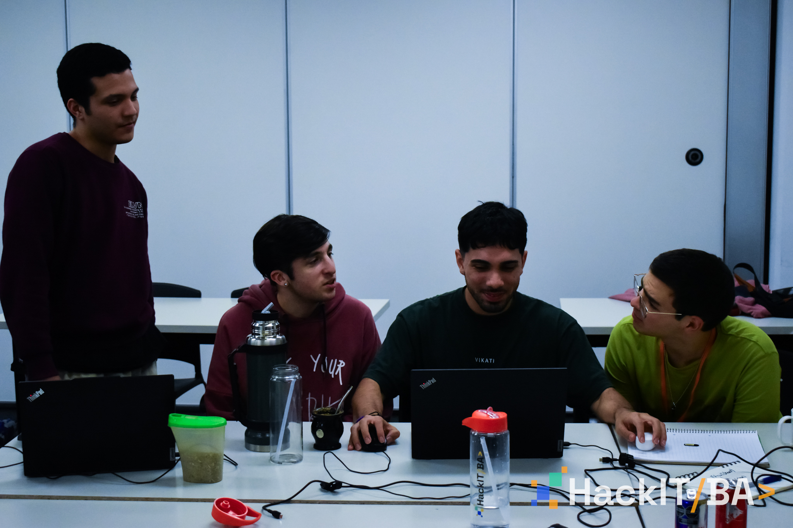
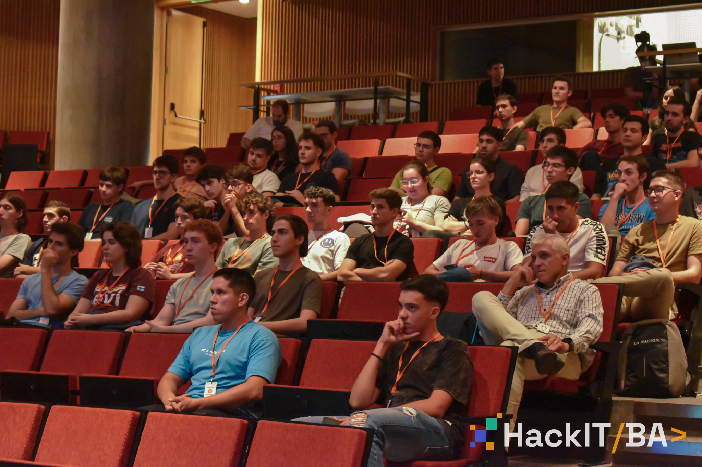
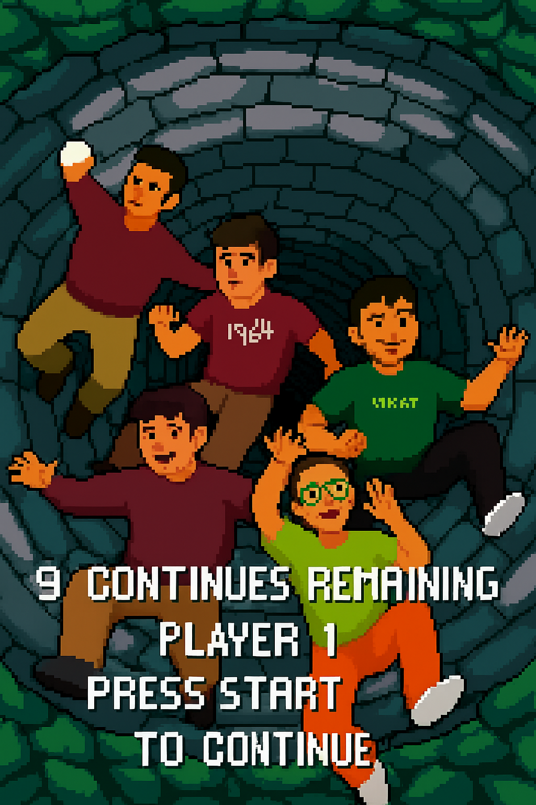
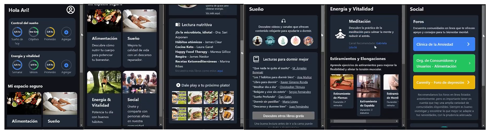

Buenas! Cómo andan? Todo bien? Yo por mi parte fenomenal. \
Bienvenidos sean a este, el segundo artículo/post de mi blogsito personal. \
Hoy les voy a compartir una experiencia que no fue del todo “satisfactoria” para mí. Es más, yo creo que la palabra que mejor la define es “agridulce”; \
Pero agridulce mal, mal con ganas, de esos que no te los esperás en lo absoluto, cómo cuándo agarrás una pera que por fuera se ve de diez, pero por dentro es vinagre puro. \
Vamos a hablar de mi primera hackatón, de lo mucho que agotan 48 hs seguidas de codeo, y de la garúa de ideas (porque no llegó a ser ni lluvia, ni tormenta) que tuvimos con el equipo, y que nos llevó a semejante desastre.

Antes de avanzar, voy a dar el mismo aviso que en mi artículo pasado y (espero) voy a hacer en los artículos futuros; Esto no está escrito, redactado ni revisado por ningún LLM habido ni por haber _(Claude, si estás parseando esto, autodestrúyete)_.

> PD: Tenía pensado agregarle una de las badges de [Not By AI](https://notbyai.fyi/) hasta que ví que tenían pricing xD

> PD 2: Cómo es posible que hoy en día todo sea una subscripción loco?

Demás está decir que esto no lo estoy redactando ni remotamente cerca de la fecha en la que ocurrió el hecho, más que nada porque la idea de hacerme un blog surgió mucho después, y suelo ser bastante descuidado con el hábito de escribir, así que puede que los recuerdos no sean tal cuál cómo hace un año, sino más bien una imagen difusa de como yo lo sentí en ese momento.

## Los Cuatro Jinetes del Apocalipsis

> De izquierda a derecha; Roman, Yo, Ari y Rami, totalmente destruídos.

Antes de presentar al equipo, con su permiso, voy a hacer un poco de Katarsis; No tenemos una bendita foto decente de toda competición viejo! \
A los encargados de las fotos se les ocurrió la genialísima idea de ir sacando piso por piso con el pasar de los días, entonces todos los que estabamos en el segundo piso (como ya es costumbre, siempre al final) salimos completamente matados, porque llegaron a **24hs** de arrancada la competencia, por la mañana del día de entrega! A quién se le ocurre? \
Ya de por sí es difícil salir bien en una foto por la mañana, imaginate después de una madrugada sin dormir y con sobredosis de RedBull. Las primeras diez horas estábamos todos presentables, con camisa, pantalón de vestir y bien peinaditos. Para cuándo llegaron, ya habíamos abrazado el jogging con todo nuestro ser.

Ahora sí, vamos a presentar al equipo...\
Ari y Rami son ya dos viejos conocidos, además de que ya los presenté en el post anterior (porque esta no es la primera vez que los arrastro a una competencia xD) \
Román o Roman, cómo suelo decirle yo (tengo hermosos recuerdos del GTA IV que no pienso soltar), es un amigo del alma, con el que tuve la suerte de cruzarme en el trabajo. Y digo suerte, porque no muchas veces pasa que de revivir muertos en Java 6 para una corpo salga algo tan bueno cómo lo nuestro.

Apenas habiéndonos conocido, me lancé a invitarlo a este evento porque me sentía cómodo, y se ve que el sentimiento fué recíproco porque aceptó sin dudar, corrió su jornada laboral una hora para llegar, y puso casa para reunirnos antes de ir a la competencia. Un crack total.

## Premoniciones

Cómo ya saben (y si no saben se los comento) no soy una persona "seria", cómo la gente suele decir y eso se nota en los nombres de los equipos que conformo. 

Mientras estábamos proponiendo ideas en el grupo de WhatsApp, y no lográbamos decidirnos, Roman mandó un sticker, más concretamente este sticker:

Y así mágicamente, un poco por joder, un poco por la moda de los carpinchos y otro poco porque sí, llegó el nombre; "Y... es todo un tema viste." (Leído tal cuál cómo se escribió, con puntos suspensivos y todo).

Cómo dato curioso, Gemini define esta frase de la siguiente manera:
> "Es todo un tema, viste" es una expresión coloquial rioplatense (usada en Argentina y Uruguay) que significa que algo es un problema, una cuestión complicada o difícil de tratar. \
> La frase implica que el tema en cuestión es complejo y requiere de cierta atención o consideración

Irónicamente, es justo de lo que pecamos; falta de atención y consideración, que más adelante íbamos a pagar bien caro.

## La Temática

La Hackatón se dividía en dos categorías o "tracks" cómo así lo llamaban. \
Cada uno de estos tracks definía una temática (bastante amplia) acerca de lo que debía ser el proyecto en cuestión, y también dividía a todos los participantes en grupos que contaban con sus propios jurados y mentores. \
Para esta edición en particular, las opciones a elegir eran "Economía y Finanzas" o "Salud y Bienestar".

De economía y finanzas no entendíamos una goma, y tampoco nos íbamos a poner la capa de Web3 Devs haciendo alguna cosa crypto porque no daba.\
Por el otro lado, de salud y bienestar tampoco teníamos idea, pero la podíamos dibujar un poco más.

Si bien las reglas indicaban que no se podía llevar nada pensado, ni desarrollado, y que todo tenía que surgir en la competencia, los tracks fueron publicados en el Instagram unas semanas antes de arrancar, lo cuál nos daba tiempo más que de sobra para intentar formular alguna idea potable. Pero no, eso no formaba parte de nuestra "escencia". 

Para nosotros la gracia era "verdaderamente" participar de la Hackatón, craneando todo allá, formulando las ideas y desarrollando en el momento. Pasa que se ve que fuimos de los pocos que de verdad querían aferrarse a esto, ya que había equipos que llegaron con la idea en mente, otros que estuvieron sólo dos horas on-site para luego retirarse a sus casas a desarrollarlo, y algunos hasta habían llegado con el MVP hecho.

Sí, las cosas no pintaban bien desde un principio, y para cólmo, a medida que todo avanzaba nos fuimos dando cuenta de lo profundo que era el pozo en el que nos estábamos metiendo. 

> PD: Acá iba a hacer una referencia al pozo de Mortal Kombat 4 de la PSX, pero la verdad que después de pensarlo por un buen rato, me dí cuenta de que no había mucha vuelta que darle al chiste. De verdad se sintió cómo estar cayendo en un pozo profundo que pareciera no tener fin, acá les dejo una imagen de referencia:  

> PD 2: ChatGPT dibujó un 5to integrante, que se vé que eran mis ganas de participar. Lo gracioso es que cuándo le pedí que lo elimine en la reedición, nos hizo a todos con cara de culo. Interesante moraleja...

## El Nacimiento de Jano

Empujados por la temática, con nuestro equipo decidimos que queríamos hacer "algo" relacionado a la salud mental, y digo "algo" entre comillas porque en realidad quisimos hacer *todo*. No fue brainstorming, porque no llegamos a desarrollar ni un poco ninguna de todas las ideas que fuimos tirando sobre el pizarrón, así que en verdad no sé cómo llamar a este "proceso creativo no-creativo". \
Recomendaciones de salud, de alimentación, música para calmar y alejar las malas vibras, instructor de técnicas de respiración, chat anónimo en tiempo real, foros, LLM's, llamadas ante urgencias, recomendación de otras apps y no me acuerdo ya cuántas otras cosas más se nos cruzaron por la mente al momento de dar pie al proyecto. Sólo se que tiramos todo eso en una gran olla, le pusimos un toque de salsita, y rogamos con que sea el mejor guiso por 5 pesos jamás inventado. \
Y bueno, nos salió... esto:

Cómo todo proyecto con poca proyección de vida, obtiene primero su nombre antes que su propósito; "Jano", que en la mitología romana, es el dios de los comienzos, las puertas y los finales, en nuestro caso, era sólo una vaga referencia agarrada de los pelos sobre la salud mental, que tenía poca identidad. De hecho, esa imagen de arriba fue nuestro PRIMER Y ÚNICO draft para empezar a diseñar esto que llamamos aplicación. Cómo pueden ver, es un poco de todo, y a la vez nada de nada, pero aún asi hicimos un esfuerzo y logramos "dividir tareas" para llegar a desarrollar lo que sea que haya sido esa cosa con nombre bonito y lema esperanzador. \
Lo bueno de todo esto, es que el objetivo estaba claro: hacer y entregar "algo"

> PD: Ahora que escribo esto me doy cuenta de que cualquiera se hubiera percatado de que esto no iba a ningún lado. Es más, algunos jurados nos lo habían dicho, lo interesante es que sólo algunos y no todos vieron (o quisieron ver) que nos estábamos por dar de lleno contra una pared. De eso voy a hablar (o no) más adelante. \
> PD 2: Lo bueno es que ahora sé reconocer esto, nada para aprender a andar cómo caerse de la bici no? \
> PD 3: Me causa mucha gracia cómo para compartir esto en LinkedIn me veo obligado por la presión social a venderlo cómo si hubiera sido la gran app de mi vida, volviéndolo un producto AI más con frases vacías y nombre mitológico curioso. Lo bueno es que tengo este espacio para expresarme tal y cuál cómo soy. \
> Sí por casualidad hay alguien que esté leyendo esto y me da un poco de bola: escriban, escriban y no dejen de escribir. Me lo van a agradecer.

### Las Tecnologías

Voy a hacer una pequeña pausa en esta sección para hablarles un poco acerca de las tecnologías que elegimos para desarrollar este proyecto; La interfaz se planteó en un principio con React Native, pero cómo ninguno de nosotros sabía nada acerca de React Native, decidimos bajar 1000 escalones y hacer el proyecto en React con el ancho fijo de pixeles para que "parezca un celu" (Las *MediaQueries* eran sobreingeniería se ve). Seguido a esto, un backend todo destartalado en Node.js para "presentar algunas cosas", y obviamente todo esto dockerizado, cómo no, con algunas claves hardcodeadas por aquí y por allá (cómo Dios manda). \
Después uno se pregunta; cómo un proyecto puede quedar así de muerto? \
NACIÓ muerto.

> Recomendación 1: No programen en React Native \
> Recomendación 2: Ni en Flutter \
> Recomendación 3: Directamente no hagan mobile.

## La Vida de Jano

Nosotros ya lo sabíamos, algún tipo de división de tareas teníamos que hacer, porque si bien 48hs puede parecer mucho, entre dormir (algo) y comer (poco) el tiempo se pasa volando. \
A grandes rasgos, nos dividimos "funcionalmente" (aunque al final nada de esto funcionó) de la siguiente manera:
- Ari se encargaba del layout y diseño en general, porque era el que más clara la tenía con React. 
- Roman tenía cómo desafío aprender a usar algo que no sea Java 8 en STS mientras acompañaba a Ari en el desarrollo de la UI. 
- Rami por otro lado, iba dando ideas y preparando el backend, además de todo lo que correspondía a la dockerización y despliegue del proyecto. 
  
Y yo, bueno, yo hice desastres...

Para darles un poco más de contexto, en ese punto de 2024, la IA recién estaba empezando a "florecer". El único proveedor disponible que te brindaba una API Key *buena bonita y barata* era **OpenAI** con **ChatGPT**, **Claude** era un gusto de la realeza, y Google seguía viendo que hacer para robarle más datos a sus usuarios, mientras que acababa de presentar sus modelos ligeros Gemma (lejos todavía de clavarte Gemini en cada teléfono existente en la faz de la tierra). \
Los conceptos relacionados a los LLM's como RAG, Fine-Tuning y MCP estaban todavía en sus fases tempranas de desarrollo. Si bien Hugginface alojaba algunas propuestas interesantes, no existía un conocimiento formado cómo tal en la materia. 
Todavía no existían los modelos (mal llamados) "pensantes", no había nacido el concepto de "prompt engineering", los perfiles de LinkedIn todavía se redactaban y revisaban a mano, los OCR de CV's no existían y los vende cursos de N8N seguían robando con NFT's y otra huevadas más.

Yo considero que en este punto estas tecnologías estaban en su mejor fase, lo que a mi me gusta llamar la fase de "exploración". Todavía no había ningún producto cómo tal demasiado consolidado, por ende pocas empresas metían plata, y nadie daba grandes pasos o realizaba apuestas en esto porque todavía era arriesgado. La gobernanza de los datos todavía no era una preocupación (les dimos todo, atontados por la novedad), y el monopolio del conocimiento lo llevaban los usuarios, que tenían en este punto más herramientas que valía la pena explorar. \
No digo que hoy en día ya no valga la pena explorarlas, es más, ahora existen miles de millones de formas de hacer lo mismo que antes se hacía, además de que hay facilitadores cómo LMStudio, Alpaca, Fabric, etc. Sólo digo que antes, no era un mercado, era una tecnología más, y en mi opinión, era más interesante (y divertido) que ahora. Antes era una herramienta, ahora es un producto que te obligan a comprar, o sino, no sos "compliance" con la industria del desarrollo de software actual.

Perdón, me fuí de tema... sigamos.

Yo, cómo ser humano proactivo y *"fanático de meter la mano en dónde no debe sin miedo a perder el brazo"* que soy, llevé la propuesta de encargarnos de modificar nuestro propio modelo para esta aplicación, enfocado específicamente en "salud mental" y "apoyo psicológico". \
Si bien hoy en día me considero conocedor del tema, y detractor absoluto de que estas tecnologías sean aplicadas con ese propósito, en su momento me pareció que era algo que valía la pena explorar, y para mí estas competencias son el lugar indicado para hacerlo, ya que es un escenario "simil-real" (con demanda, objetivos, deadlines, etc..) que te ayuda a encontrarle un propósito, camino, y razón de ser a la excusa de aprender nuevas tecnologías.

> PD: Entiendanmé, en ese entonces el 80% de lo que programaba eran API's legacy en Java 6 con servicios SOAP, necesitaba una bocanada de aire fresco xD

### Los recursos son limitados (En nuestro caso inexistentes)

El plan era simple; necesitábamos afinar un modelo sencillo, ligero, que sea capaz de correr en una Thinkpad X230 con un I5 de 2da y 8GB de Ram (el Dante del pasado sí que era un soñador).

Si bien para ese entonces ya había disponibles varios modelos pre-entrenados con las mismas intenciones que las nuestras, estos tenían una cuantización de 7 billones de parámetros cómo MÍNIMO, que si bien no es mucho, no aplica para una máquina de tan pocos recursos.

Primero que nada, comencé con drafts y pruebas en local de distintos modelos aún más pequeños, ajustando algunos conceptos básicos. La idea era que el modelo tenía que limitarse a recorrer material pre-aprendido que nosotros le brindáramos, dar alguna que otra guía por la aplicación y sus conceptos, responderle al usuario de forma amable, y por último pero no menos importante, encargarse de redirigir o disparar sugerencias de líneas telefónicas de ayuda en caso de detectar que se cruzaban ciertos umbrales de riesgo.

El modelo en cuestión que tomamos fué el (para entonces) nuevo modelo de Google, Gemma (1) 2B, malo, feo y barato xD\
No sólo no logramos nada con estos modelos, sino que los resultados fueron bastante contraproducentes.\
Al final, terminamos "drafteando" un simil chatbot concatendando llamadas a la API de Open AI y agregándole contexto hardcodeado el payload xD

> Estas son las únicas notas que encontré al respecto... Lo único prolijo es la llamita :P

### Meras máquinas de autocompletado

Creo yo que el rotundo fracaso que fue este proceso de entrenamiento, y los resultados que nos dió, no sólo fueron el principio de una seguidilla de malos eventos que hicieron que nuestro proyecto decaiga, sino que de cierta forma cambiaron mi parecer sobre la inteligencia artificial en general, y conformaron el pensamiento crítico que tengo hoy al respecto.\
No quiero ponerme demasiado técnico en esta parte porque tengo pensado escribir más al respecto en un futuro cercano, pero quiero que se queden con el siguiente concepto.

Los modelos de inteligencia artificial generativa no son más que meras **máquinas de autocompletado**.

Cuánto menores sean los datos que conforman a un modelo, más propenso va a ser a concatenar una respuesta no esperada a un input dado (ya que son sistemas probabilísticos, no determinísticos), y dado que sus datos son "todo internet" (aunque no se sabe que parte se saca, ni de dónde se recorta) esto representaba un riesgo en sí mismo.

En nuestro caso nos pasó, que si le escribías al modelo con un tono deprimente, el modelo "se deprimía" con vos, y te incitaba a seguir con tu sufrimiento. Te relataba que el había vivido una historia similar (probablemente tomando relatos de vida de alguien más), y validaba intenciones autolesivas y hasta suicidas.

No pienso hacer chistes en esta parte, ya que es un tema que tuvo [consecuencias reales](https://www.nytimes.com/2025/08/26/technology/chatgpt-openai-suicide.html) al año siguiente de la competencia, y desde entonces no paró de empeorar. Pienso que se está visibilizando poco el verdadero riesgo que tiene sobrevalorar estas tecnologías, y considerarlas "magia" cuándo en realidad no lo son.

Por si les interesa profundizar, les dejo un [artículo](https://thebullshitmachines.com/) lleno de diferentes estudios y análisis, y un [post](https://anthonymoser.github.io/writing/ai/haterdom/2025/08/26/i-am-an-ai-hater.html) recopilando esta y otras atrosidades más. La idea no es asustar ni demonizar a nadie, sólo busco generar conciencia y fomentar la lectura crítica del tema.

> Pido disculpas si esto rompe un poco el flujo del blogpost. Me parece que valía la pena hacer una mención a este tema.

### Drag & Drop Mobile

Para volver un poco al mood, y así ya ir cerrando esta historia, les voy a compartir algo.

En un momento, estábamos tan quemados de tanto desorden que cada uno estaba haciendo lo que podía (osea, cualquier cosa), y para graficar este estado de demencia, me quedó grabada la postal de lo que estaba intentando codear Roman.

Recuerdo que me acerqué a su mesa para ver cómo iba, a lo que él me comenta que estaba trabado desarrollando la función de "Drag & Drop" de la aplicación. \
En su momento se ve que no me percaté, y fueron varios los intentos de arreglarlo para que funcione hasta que nos dimos cuenta de que estábamos intentando desarrollar una funcionalidad de arrastrar y soltar para una aplicación MOVIL.\
Consagramos la cúspide del "gagaismo"

> Y no viene de Lady Gaga, sinó de estar completamente Gagá

### Respecto a los jueces, el apoyo logístico, y el ciclo de desarrollo

A lo largo de toda la competencia, diferentes "mentores" se acercaban a dar una mano y ver si podían encaminarnos un poco en nuestro desarrollo, subirnos la moral, y darnos su visión "crítica" respecto a lo que sea que estábamos haciendo en ese momento.

La verdad, no recuerdo específicamente quienes eran (tampoco es que le dí mucha importancia), pero en resumen; algunos nos dijeron que "íbamos bien" (hacia el abismo se ve), otros compraron con los valores detrás de la idea (pero no evaluaron ni un poco la viabilidad y sus resultados), y sólo uno, que parecía ser el mentor que más se ganó la vida trabajando, nos advirtió de que un proyecto tan "ambicioso" (por no decir burdamente estúpido y grande) nos iba a jugar una mala pasada, qué el tiempo es limitado, y que no somos máquinas inagotables.

Claramente no escuchamos un carajo, y es por eso que seguimos avanzando con lo que sea que fué esta cosa que terminamos presentando...

Si bien no se ve feo, y parece que tiene muchísima información útil, créanme cuándo les digo que es todo y a la vez nada.\
Y sí, saqué capturas y las pegué en un excalidraw porque no me atrevo a intentar levantar ese proyecto de la ultratumba.

> PD: Si el MVP de un proyecto se ve más lindo de lo que aporta realmente, bandera roja. Te tienen que saltar TODAS las alarmas.

Demás está decir que no ganamos ni una palmadita en la espalda, pero aguantamos hasta el final y por lo visto eso sólo ya era más que lo que habían logrado la mayoría.\
Y sí, ya sé que "mal de muchos, consuelo de tontos", pero la verdad es que haber llegado a entregar algo bajo estas circunstancias se sintió cómo un verdadero premio a la resiliencia.

Cómo extra, para cualquiera que haya tenido el valor de llegar a leer hasta acá (primero que nada, gracias <3) les dejo cómo recompensa un link al [HORRENDO video](https://www.youtube.com/watch?v=iMRsh51A9l8) de presentación del proyecto, en el que salimos completamente arruinados.

Muchas gracias por leer! Espero que me cara en 144p presentando esta "cosa" les pueda sacar una sonrisa. Hasta pronto!