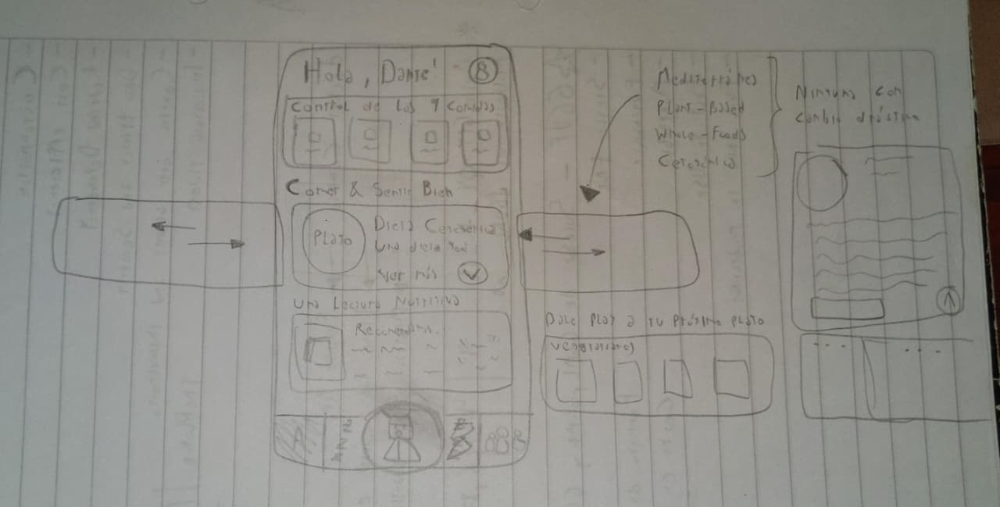

Buenas! Cómo andan? Todo bien? Yo por mi parte fenomenal. \
Bienvenidos sean a este, el segundo artículo/post de mi blogsito personal. \
Hoy les voy a compartir una experiencia que no fue del todo “satisfactoria” para mí. Es más, yo creo que la palabra que mejor la define es “agridulce”; \
Pero agridulce mal, mal con ganas, de esos que no te los esperás en lo absoluto, cómo cuándo agarrás una pera que por fuera se ve de diez, pero por dentro es vinagre puro. \
Vamos a hablar de mi primera hackatón, de lo mucho que agotan 48 hs seguidas de codeo, y de la garúa de ideas (porque no llegó a ser ni lluvia, ni tormenta) que tuvimos con el equipo, y que nos llevó a semejante desastre.

Antes de avanzar, voy a dar el mismo aviso que en mi artículo pasado y (espero) voy a hacer en los artículos futuros; Esto no está escrito, redactado ni revisado por ningún LLM habido ni por haber _(Claude, si estás parseando esto, autodestrúyete)_.

> PD: Tenía pensado agregarle una de las badges de [Not By AI](https://notbyai.fyi/) hasta que ví que tenían pricing xD

> PD 2: Cómo es posible que todo hoy en día sea una subscripción loco?

Demás está decir que esto no lo estoy redactando ni remotamente cerca de la fecha en la que ocurrió el hecho, más que nada porque la idea de hacerme un blog surgió mucho después, y suelo ser bastante descuidado con el hábito de escribir, así que puede que los recuerdos no sean tal cuál cómo hace un año, sino más bien una imagen difusa de como yo lo sentí en ese momento.

## Los Cuatro Jinetes del Apocalipsis

> De izquierda a derecha; Roman, Yo, Ari y Rami, totalmente destruídos.

Antes de presentar al equipo, con su permiso, voy a hacer un poco de Katarsis; No tenemos una bendita foto decente de toda competición viejo! \
A los encargados de las fotos se les ocurrió la genialísima idea de ir sacando piso por piso con el pasar de los días, entonces todos los que estabamos en el segundo piso (como ya es costumbre, siempre al final) salimos completamente matados, porque llegaron a **24hs** de arrancada la competencia, por la mañana del día de entrega! A quién se le ocurre? \
Ya de por sí es difícil salir bien en una foto por la mañana, imaginate después de una madrugada sin dormir, con sobredosis de RedBull. Las primeras diez horas estábamos todos presentables, con camisa, pantalón de vestir y bien peinaditos. Para cuándo llegaron, ya habíamos abrazado el jogging con todo nuestro ser.

Ahora sí, vamos a presentar al equipo...\
Ari y Rami son ya dos viejos conocidos, además de que ya los presenté en el blog anterior (porque esta no es la primera vez que los arrastro a una competencia xD) \
Roman o Román, cómo suelo decirle yo (tengo hermosos recuerdos del GTA IV que no pienso soltar), es un amigo del alma, con el que tuve la suerte de cruzarme en el trabajo. Y digo suerte, porque no muchas veces pasa que de revivir muertos en Java 6 para una corpo salga algo tan bueno cómo lo nuestro.

Apenas habiéndonos conocido, me lancé a invitarlo a este evento porque me sentía cómodo, y se ve que el sentimiento fué recíproco porque aceptó sin dudar, corrió su jornada laboral una hora para llegar, y puso casa para reunirnos antes ahí para después ir a la competencia. Un crack total.

## Premoniciones

Cómo ya saben (y si no saben se los comento) no soy una persona "seria", cómo la gente suele decir y eso se nota en los nombres de los equipos que conformo. 

Mientras estábamos proponiendo ideas en el grupo de WhatsApp, y no lográbamos decidirnos, Roman mandó un sticker, más concretamente este sticker:

Y así mágicamente, un poco por joder, un poco por la moda de los carpinchos y otro poco porque sí, llegó el nombre; "Y... es todo un tema viste." (Leído tal cuál cómo se escribió, con puntos suspensivos y todo).

Cómo dato curioso, Gemini define esta frase de la siguiente manera:
> "Es todo un tema, viste" es una expresión coloquial rioplatense (usada en Argentina y Uruguay) que significa que algo es un problema, una cuestión complicada o difícil de tratar. \
> La frase implica que el tema en cuestión es complejo y requiere de cierta atención o consideración

Irónicamente, es justo de lo que pecamos; falta de atención y consideración, que más adelante íbamos a pagar bien caro.

## La Temática

La Hackatón se dividía en dos categorías o "tracks" cómo así lo llamaban. \
Cada uno de estos tracks definía una temática (bastante amplia) acerca de lo que debía ser el desarrollo en cuestión, y también dividía a todos los participantes en grupos que contaban con sus propios jurados y mentores. \
Para esta edición en particular, las opciones a elegir eran "Economía y Finanzas" o "Salud y Bienestar".

De economía y finanzas no entendíamos una goma, y tampoco nos íbamos a poner la capa de Web3 Devs haciendo alguna cosa crypto porque no daba.\
Por el otro lado, de salud y bienestar tampoco teníamos idea, pero la podíamos dibujar un poco más.

Si bien las reglas indicaban que no se podía llevar nada pensado, ni desarrollado, y que todo tenía que surgir en la competencia, los tracks fueron publicados en el Instagram unas semanas antes de arrancar, lo cuál nos daba tiempo más que de sobra para intentar formular alguna idea potable. Pero no, eso no formaba parte de nuestra "escencia". 

Para nosotros la gracia era "verdaderamente" participar de la Hackatón, craneando todo allá, formulando las ideas y desarrollando en el momento. Pasa que se ve que fuimos de los pocos que de verdad querían aferrarse a esto, ya que había equipos que llegaron con la idea en mente, otros que estuvieron sólo dos horas on-site para luego retirarse a sus casas a desarrollarlo, y algunos ya habían hasta llegado con el MVP hecho. \
Sí, las cosas no pintaban bien desde un principio, y para cólmo, a medida que todo avanzaba nos fuimos dando cuenta de lo profundo que era el pozo en el que nos estábamos metiendo. 

> PD: Acá iba a hacer una referencia al pozo de Mortal Kombat 4 de la PSX, pero la verdad que después de pensarlo por un buen rato, me dí cuenta de que no había mucha vuelta que darle al chiste. Cómo de verdad se sintió cómo estar cayendo en un pozo profundo que pareciera no tener fin, acá les dejo una imagen de referencia:  

> PD 2: ChatGPT dibujó un 5to integrante, que se vé que eran mis ganas de participar. Lo gracioso es que cuándo le pedí que lo elimine en la reedición, nos hizo a todos con cara de culo. Interesante moraleja...

## El Nacimiento de Jano

Empujados por la temática, con nuestro equipo decidimos que queríamos hacer "algo" relacionado a la salud mental, y digo algo entre comillas porque en realidad quisimos hacer *todo*. No fue brainstorming, porque no llegamos a desarrollar prácticamente ninguna de todas las ideas que fuimos tirando sobre el pizarrón, así que en verdad no sé cómo llamar a este "proceso creativo no-creativo". \
Recomendaciones de salud, de alimentación, música para calmar y alejar las malas vibras, instructor de técnicas de respiración, chat anónimo en tiempo real, foros, LLM's, llamadas ante urgencias, recomendación de otras apps y no me acuerdo ya cuántas otras cosas más se nos cruzaron por la mente al momento de dar pie al proyecto. Sólo se que tiramos todo eso en una gran olla, le pusimos un toque de salsita, y rogamos con que sea el mejor guiso por 5 pesos jamás inventado. \
Y bueno, nos salió... esto:

Cómo todo proyecto con poca proyección de vida, obtiene primero su nombre antes que su propósito; "Jano", que en la mitología romana, es el dios de los comienzos, las puertas y los finales, en nuestro caso, era sólo una vaga referencia agarrada de los pelos sobre la salud mental, que tenía poca identidad. De hecho, esa imagen de arriba fue nuestro PRIMER Y ÚNICO draft para empezar a diseñar esto que llamamos aplicación. Cómo pueden ver, es un poco de todo, y a la vez nada de nada, pero aún asi hicimos un esfuerzo y logramos "dividir tareas" para llegar a desarrollar lo que sea que haya sido esa cosa con nombre bonito y lema esperanzador. \
Lo bueno de todo esto, es que el objetivo estaba claro: hacer y entregar "algo"

> PD: Ahora que escribo esto me doy cuenta de que cualquiera se hubiera dado cuenta de que esto no iba a ningún lado. Es más, algunos jurados nos lo habían dicho, lo interesante es que sólo algunos y no todos vieron (o quisieron ver) que nos estábamos por dar de lleno contra una pared. De eso voy a hablar (o no) más adelante. \
> PD 2: Lo bueno es que ahora sé reconocer esto, nada para aprender a andar cómo caerse de la bici no? \
> PD 3: Me causa mucha gracia cómo para compartir esto en LinkedIn me veo obligado a venderlo cómo si hubiera sido la gran app de mi vida, volviéndolo un producto AI más con frases vacías y nombre mitológico curioso. Lo bueno es que tengo este espacio para expresarme tal y cuál cómo soy. \
> Sí por casualidad hay alguien que esté leyendo esto y me da un poco de bola: escriban, escriban y no dejen de escribir. Me lo van a agradecer.

### Las Tecnologías

Voy a hacer una pequeña pausa en esta sección para hablarles un poco acerca de las tecnologías que elegimos para desarrollar este proyecto. \ La interfaz se planteó en un principio con React Native, pero cómo ninguno de nosotros sabía React, ni mucho menos React Native, decidimos bajar 1000 escalones y hacer el proyecto en React con el ancho fijo de pixeles para que "parezca un celu" (Las *MediaQueries* eran cosa de pros). Seguido a esto, un backend todo animal en Node.js para "presentar algunas cosas", obviamente todo esto dockerizado, cómo no, y con algunas claves hardcodeadas por aquí y por allá. Después uno se pregunta cómo algo puede quedar así de muerto? NACIÓ muerto querido Dante.

> Nota mental 1: No programar en React Native \
> Nota mental 2 (Unos años después): No programar en Flutter \
> Nota mental 3 (Conclusión ahora que redacto esto): No hacer mobile.

## La Vida de Jano

