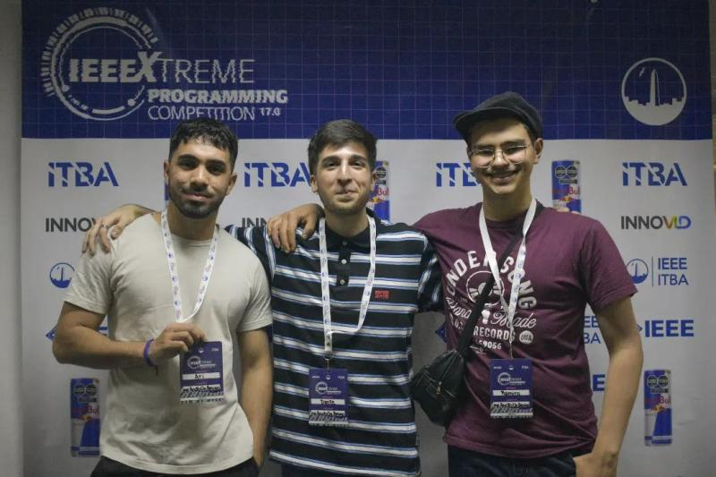
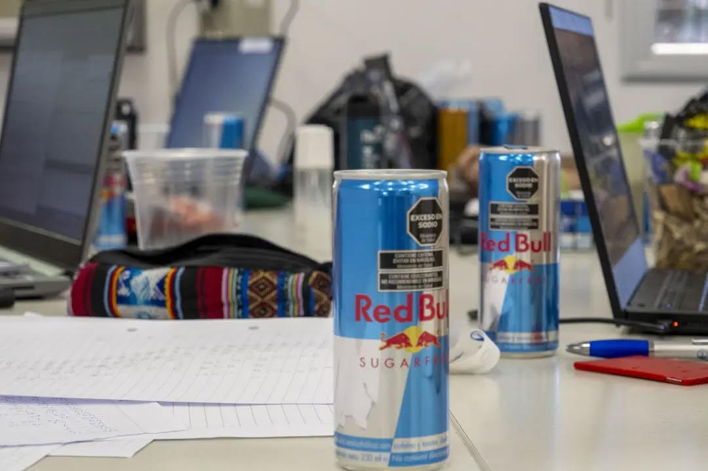
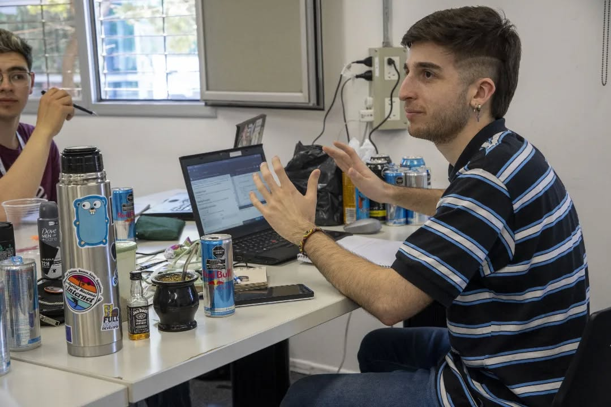
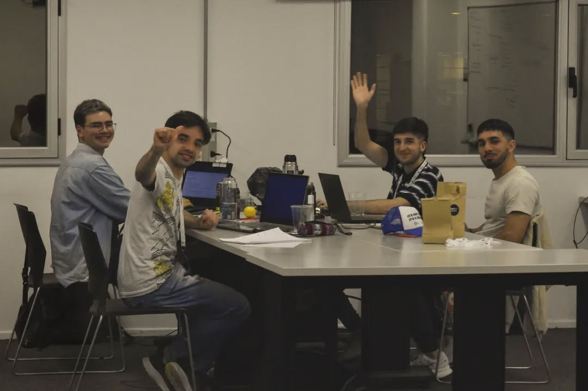
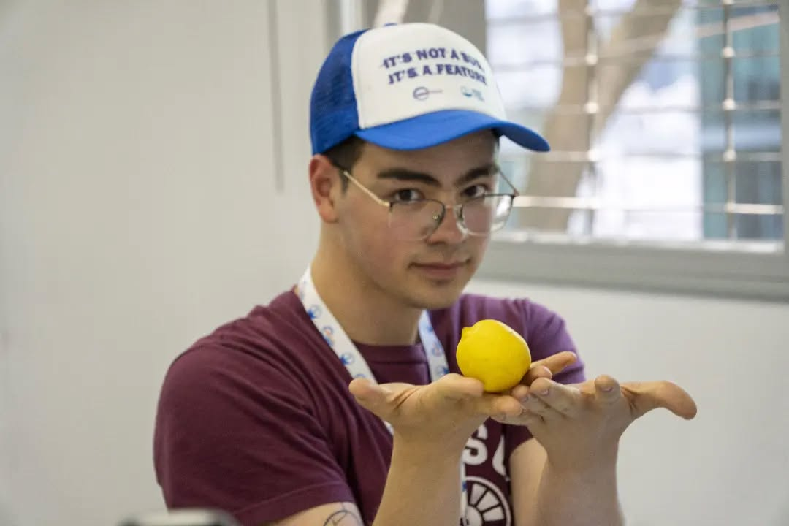
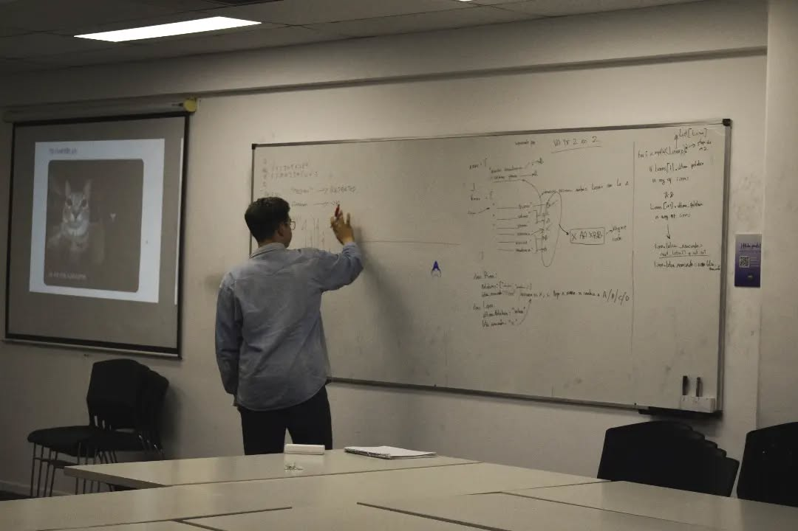
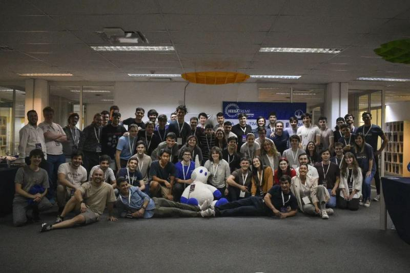

Buenas! Como andan? Todo bien? \
Les doy la bienvenida a este, el primer post en mi blog, que trata sobre mi primer experiencia con la programación competitiva en equipos, presencial y "maratoneal" (lease como adjetivo calificativo de *maratón*). \
No es mi primera vez redactando, pero si es la primera vez que escribo algo que no sea meramente documentación técnica, así que ténganme un poco de piedad.

> Aclaración importante: \
> Si bien esta entrada está datada del 28 de Octubre de 2023, estoy redactando esto dos años después, Mayo del 2025, que fue cuando decidí empezar a plasmar mis experiencias pasadas en "papel", y compartirlas con el mundo (si es que acaso alguien está leyendo esto). \
> Si bien mi recuerdo puede estar difuso, voy a tratar de dejar expresado mi sentimiento tal  cuál como fue, para intentar no perderlo del todo (Ese es el verdadero motivo de este blog).

> Otra aclaración importante:\
> No, no está escrito con IA, ni repasado por ChatGPT, Claude, Gemini, ni nada que se le asemeje. \
> Está todo redactado por mí, revisado (ponele) por mí, y publicado por mí, así que es muy probable que encuentren algún error, alguna falla en la redacción, o algún *typo* (sobretodo porque en invierno las manos se me congelan y el caloventor me da solo en las patas).\
> Nuevamente, ténganme un poco de piedad, o no, va, yo que sé. Hagan lo que quieran

## El Equipo

> Ariel, Dante (Yo) y Ramiro, en ese órden.\
> PD: Sé que la calidad es paupérrima, pero todavía no pude encontrar las fotos originales.

Voy a empezar esta breve sección sobre el equipo haciendo un análisis a raíz de su nombre, que (marcando tendencia para futuras competencias) es un chiste boludo nivel 1000 que nos causó gracia cuando uno lo dijo y así quedó.

El reconocido meme de `meAnotoUnAmigo` (sí, escrito en camelCase) fue el icónico nombre de nuestro equipo, que en sí no tenía mucha ciencia; \
Ari me propuso de anotarnos, yo le dije de anotar a Rami, y con Rami terminamos de convencer a Ari de anotarnos los tres.

Ah, claro, me faltó presentar a Ari y a Rami;\
Ariel es amigo de la facultad. Nos conocimos en la UNLa cuando él se acercó a mí (durante el primer año) porque le parecía recordarme de una juntada en lo de una amiga en común hace más de 4 años (ni yó se cómo tiene tanta memoria).\
Ramiro es amigo desde hace unos cuantos (muchos) años ya. Nos conocimos terminando el secundario, hablando por un grupo de discord y encontrando que teníamos en común la misma neurona nerd hiperactiva que rebotaba de acá para allá.

Cuándo se dan oportunidades cómo esta, uno piensa que lo normal hubiera sido conformar el mejor equipo para dar el mejor rendimiento en la competencia, pero nada más lejos de la realidad. \
Nos autoconvocamos por obra y gracia del espíritu santo, nosotros solos, 3 personajes, uno peor que el otro, con ganas y ánimos de participar. \
Nunca nos pusimos a pensar si teníamos las capacidades para llevar a cabo el reto, ni la experiencia/práctica previa necesarias, nisiquiera sabíamos programar todos en el mismo lenguaje! 

Yo creo que fué el momento, las ganas de animarse, las ansias por participar, la emoción por lo nuevo. En este contexto, nada de lo antes mencionado importaba. \
Pero pegó, más adelante nos dimos cuenta que sí importa estar preparados, y que no era joda una competencia de este calibre. Más que nada por la dificultad de los retos, y el nivel de exigencia personal que manejaba (y maneja a día de hoy) cada uno de nosotros.

## Programación Competitiva? Sí. Presencial? No. Durante 24hs? Esperá, qué...?

Si bien para cuando decidimos participar, yo ya contaba con algo de experiencia en la programación competitiva (5 ejercicios de Hackerrank a medio hacer), nunca había participado en una competencia presencial, menos en equipo, y mucho menos durante 24hs.\
No sé si fue la promesa del catering durante todo el evento o qué (mentira, todos sabemos que sí lo fué), pero al menos yo no había dimensionado el semejante peso que tiene un evento de estas características.\
En su momento no lo pensé, pero estar 24hs alerta resolviendo ejercicios no es moco de pavo.\
Requiere concentración, descansos regulados, y lo más importante, estabilidad mental. \
Ya es difícil juntar todas esas características en una semana normal de trabajo, imaginate en un día entero, con todo el estrés que una competencia conlleva. TODO me resultó exponencial.

Cuándo lograba resolver un ejercicio, me sentía dios, pero cuando me trababa durante horas con uno, era un simple don nadie merecedor del más profundo infierno que jamás se haya imaginado.

El mayor desafío fue personal, y sí, se que parece una de esas huevadas que uno pone en el LinkedIn de "fue un gran desafío profesional y personal", pero estoy hablando en serio... \
Para alguien como yo, que tiene una exigencia altísima para consigo mismo (tanto que a veces es perjudicial), un evento de estas características podía llegar a convertirse en una trampa mortal. \
El resolver algo se sentía como el deber, como un "así tiene que ser", y el fallar se convertía en un pecado imperdonable.

## Palíndromos, mi némesis

> Nótese la cantidad de latas de energizantes en mi escritorio, el mate, el desodorante y alguna magia más.

Recuerdo en un momento estar completamente trabado en un ejercicio algo complejo de creación de palíndromos cruzados en una matriz de sílabas. No recuerdo bien el enunciado, pero sí que en ese momento me costaba hasta entenderlo, mucho más resolverlo.

Este ejercicio formaba parte de una tanda de ejercicios complejidad medio-alta, de los que aparecían sobre la mitad de la competencia, así que uno ya venía medio limado, no sólo todo lo que resolvió antes, sino por la cantidad de horas seguidas que veníamos programando. 

Era ya la madrugada, no sé cuántas latas de RedBull me había tomado. Sentía todo rápido, pero yo estaba lento, y recuerdo que le digo a Ariel que me voy a recostar un rato porque "no daba más".

Me levanté de la mesa, me eché en el piso duro del salón de facultad que nos asignaron, agarré un buzo y me improvisé una almohada para ver si podía dormir un poco, ya que en la "no preparación" que nos caracterizaba, no llevamos ni bolsas de dormir, ni almohadas, nada.\
Ahí es cuando recordé que por mucho que uno quiera, si tenés la cabeza a mil por hora, y querés frenar en seco, desacelerar no es tan instantáneo como parece. \
No me podía dormir. La culpa, los fantasmas, los "peros", y todos los malos sentimientos se habían potenciado. Estaba cansado, muy cansado, y no me había dado cuenta.

Después de (a la fuerza) dormir un rato, me levanté renovado, sin saber que hora era.
Se sintió como que me había desmayado por días, pero solo fueron unos cuántos minutos. \
Mi nivel de azúcar en sangre se había acomodado (ponele), mis ojos descansado, y estaba recuperado, listo para atacar ese ejercicio que quedó esperando mi retorno a la batalla.

Cinco minutos después de sentarme frente a la compu lo tenía contra las cuerdas. Envié la solución, y pasó todos los tests, lo había rematado. Lo que antes fue imposible, se había vuelto sencillísimo. \
Es ahí cuando entendí que no somos máquinas y que no podemos exigirnos siempre al máximo. A veces, toca descansar, reacomodar un poco las ideas, y después seguir. \
Nuestras capacidades se pueden ver afectadas por mil y un cosas más. Muchas veces, no se trata de ser o no capaz de algo, se trata de estar preparado para afrontarlo, y dentro de esa preparación, (creo yo qué) la receta del éxito es conocerse a uno mismo. \
Manejar sus tiempos, sus descansos, saber escuchar lo que tu cuerpo te indica, y saber actuar en consecuencia son pilares fundamentales para mantener un buen rendimiento (y una buena salud, obvio).

> Sí, sé que lo que acabo de decir puede sonar a una lista de frases de autoayuda para los estados de Facebook. \
> Pero créanme cuando les digo; estas cosas pasan, y son más reales de lo que parecen. \
> Mi intención no es hablar desde una posición de superioridad o como si tuviera todas las respuestas. Ni siquiera yo me conozco al 100%, y hasta dudo mucho de que eso sea posible.
> 
> Sin embargo, lo que sí sé es que antes me conocía mucho menos. Fue a raíz de mis errores, mis pisadas en falso, y mis momentos límite como este, que me "empecé a entender". \
> Aprendí a la fuerza, y esa es la experiencia que quería compartir (con cualquiera que esté leyendo esto). 

## Las hazañas del equipo, y otros recuerdos vagos

Voy a hacer un esfuerzo para que esta sección esté medianamente conectada párrafo a párrafo, aunque en realidad, va a auspiciar más de una lista de anécdotas, recuerdos y comentarios del evento que otra cosa.

### El equipo + 1

Quiero hacer una mención especial al cuarto integrante *"no integrante"* de nuestro equipo, de quien (perdón) no me acuerdo el nombre. \
Se había anotado con un amigo, pero el amigo se bajó a último momento, y el flaco se presentó solo, como un campeón.\
Justo dio la casualidad de que le tocó en el salón de al lado, en un piso donde estábamos solo nosotros. Y bueno, obvio que lo sumamos, esas cosas pasan. \
Lo único que tengo para objetar es que teníamos la mesa perfecta; tres ThinkPads... y el loco cayó con una IdeaPad. Pero bueno, al menos era Lenovo, qué sé yo.

### Rami llevó un limón para romper el hielo

La competencia arrancaba la noche de un viernes y se extendía hasta el sábado a la misma hora.  \
El primer evento antes de comenzar era una reunión entre todos los equipos para conocernos mejor, compartir un poco, hacer sociales, y lo más importante; comer. \
Recuerdo que todos los integrantes de los demás equipos eran estudiantes del ITBA (obviamente) de distintas sedes del país. \
Nosotros, en cambio, éramos dos estudiantes de la UNLa y un "panadero", como se presentaba Rami medio en chiste, para desviar un poco las preguntas sobre qué estudiabas o no en la universidad (y los prejuicios que venían con eso). 

En ese contexto, éramos "un equipo más", incluso un escalón por debajo del resto, por lo que ya mencioné y por otros varios prejuicios: universidad pública vs privada, la carrera que elegías, o simplemente el hecho de estudiar o no.

Pasada esa reunión, arrancó la competencia y nos sentamos a resolver. Iban tirando ejercicios uno tras otro; algunos los sacábamos, otros no, y así íbamos sumando puntos para el ranking. \
Me acuerdo patente que, en un momento de la noche, largaron 3 ejercicios de golpe, y cada uno se quedó con uno para resolver por su cuenta.

Rami agarró, por lejos, el más jodido de todos. Un enunciado que mezclaba lógica, manos de póker, y algoritmos para resolver las mejores combinaciones en el menor tiempo posible. \
Para nosotros era chino básico. Ari no lo terminaba de entender, y yo en ese momento ni siquiera sabía jugar al póker (pensaba que era como un chinchón con más pasos), así que ese ejercicio tenía dueño desde el minuto cero.

Pasaban las horas, seguían cayendo ejercicios, y nosotros avanzábamos con otras tareas mientras Rami seguía completamente metido en ese mismo ejercicio que se había comprometivo a resolver hacía ya un buen rato. \
En un momento (yo estaba sentado justo enfrente), lo escucho gritar de alegría y pegar un pequeño salto de emoción. \
Tanta fue la emoción que le dió un para nada pequeño golpe a la mesa que bastó para desconectarme la máquina de la pared. (Como no tenía batería, se apagó al instante) \
Pero no importaba. Lo había resuelto, solo, sin ayuda de nadie más que de él mismo. \
Había logrado resolver ese ejercicio tan difícil que se había auto-asignado desde un principio.

Cuando se nos ocurrió revisar el ranking para ver cuántos puntos había metido, estábamos en el top 100 **mundial**, entre más de 7000 equipos inscriptos. \
Ahí me cayó la ficha: no era que Rami estaba trabado… es que *todo el mundo* lo estaba. Y él, con todo ese esfuerzo y esa dosis de esa magia que tiene (que jamás voy a terminar de entender), había sido de los pocos que lo logró resolver. \
Tanto así, que posicionó nuestro equipo en lo más alto de la pirámide, después de haber pasado horas peleándola desde el medio... 

Un rato después llegó la hora del descanso. Bien merecido, diría yo, sobre todo después de tantas horas de codear sin parar. Más aún para Rami, que se había roto la cabeza y nos hizo destacar con ese ejercicio. \
Ahí, Cuando bajamos a tomar algo, nos dimos cuenta de que no habíamos sido los únicos en revisar el ranking para ver cómo veníamos. \
Varios equipos empezaron a acercarse, reconociendo que habíamos sido de los pocos en resolver ese ejercicio. Querían saber cómo lo habíamos hecho, qué estrategia usamos, qué se nos había ocurrido. Ni lerdos ni perezosos. \
Hasta hacía un rato, éramos nosotros los que teníamos que ir a hacer sociales, sólo para que nos ignoraran o nos corrieran sutilmente. Y de golpe, en cuestión de minutos, pasamos a ser el centro de atención. Todos querían hablar con nosotros.\
Habíamos movido el piso de lugar. Y se notó.

Obviamente, en medio de tantas preguntas e indagatorias a Rami, yo intenté persuadirlo para que no ande regalando así nomás la fórmula del éxito. Algo que tanto le costó conseguir, que conformaba un logro no solo para él, sino que nos posicionaba a nosotros como el mejor equipo local, y uno de los mejores equipos mundiales. 

No hubo caso.

Terminó compartiendo todo, charlando, explicando, abriéndose con los demás como si nada. Sin esperar nada a cambio. \
Y la verdad...  no lo puedo culpar. Es mi mejor amigo, y lo respeto y valoro justamente por eso. Por ser cómo es, una buena persona. \
A veces medio boludo, pero buena persona al fín.

### No tomen tanta Red Bull

En definitiva, el IEEEXtreme fue un sacudón emocional, físico y mental que me dejó recuerdos imborrables, amistades reforzadas y algunas lecciones que todavía sigo digiriendo. \
No ganamos ningún premio, ni salimos primeros en nada, pero nos llevamos lo más valioso: la experiencia (y muchas latas de Red Bull).

¿Que cómo nos fue? \
Terminamos **1264° a nivel mundial**, entre más de 7000 equipos registrados, y **101° en Latinoamérica** sobre un total 270, lo cual no es poca cosa considerando todo lo que hubo detrás. \
En el ranking nacional quedamos **12° de 16 equipos**, lo cuál significa que todavía tenemos mucho camino por delante.

Aunque en el artículo no lo mencioné tanto (hasta ahora), Ari también fue parte clave de este equipo. Se rompió el lomo como nosotros, se gastó la pila mental y tiró una banda de código. Lástima que programó todo en JavaScript… pero bueno, nadie es perfecto.

No sé si volvería a hacerlo exactamente igual, pero tampoco cambiaría nada de lo que pasó. \
Gracias por leer hasta acá (si es que alguien lo hizo). Si no, no importa... igual necesitaba escribirlo porque después me lo olvido. \
Nos vemos en la próxima!