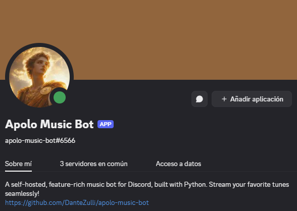
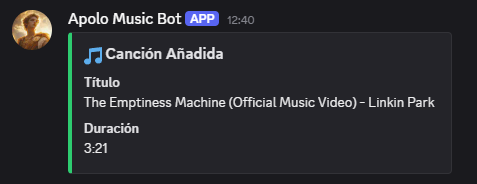
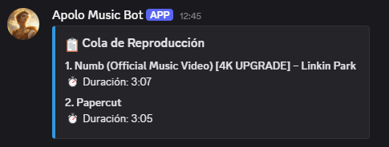
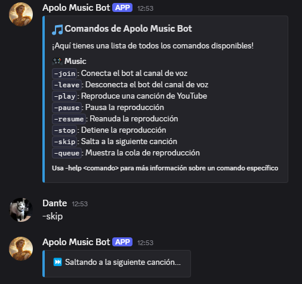

Bot de música para Discord hecho en Python. Permite reproducir canciones desde YouTube y YouTube Music, manejar una cola de temas y controlar la reproducción por comandos.

### ✨ Funcionalidades Principales

- Conexión a canales de voz
- Reproducción de YouTube
- Comandos de pausa, resume, stop, skip, queue
- Despliegue local o con Docker

### 🖼️ Capturas

- Canción recién agregada

- Cola de reproducción

- Comando de ayuda

### 🚀 Tecnologías utilizadas

- Python
- discord.py
- FFmpeg
- Docker / Docker Compose

### ¿Para qué lo hice?

Desarrollado 100% desde cero para brindar una alternativa libre, manipulable y gratuita a los bots de música tradicionales.