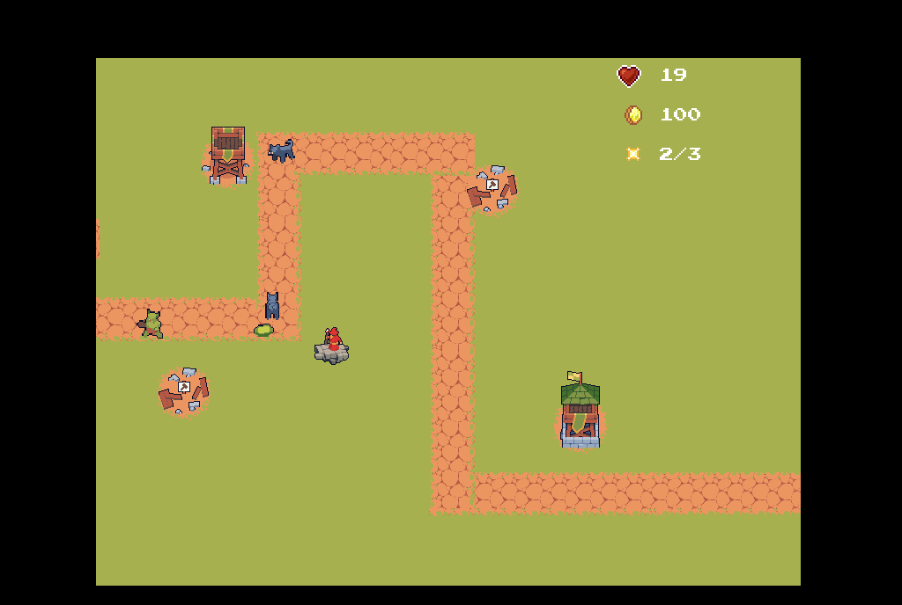

Desarrollé **Citadel Commander** como parte de la Game Jam organizada por [Paisanos.io](https://paisanos.io). Es un **tower defense** clásico con estética medieval en pixel art, inspirado en títulos como *Kingdom Rush*, completamente desarrollado, desplegado y presentado en **8 horas de jam** y usando assets gratuitos de [OpenGameArt](https://opengameart.org/).

El proyecto contemplaba implementar un **sistema de loop incremental interno**, basado en la gestión de oleadas definidas por pesos y dificultades crecientes, para generar waves cada vez más complejas. Ya incluía **varios tipos de enemigos** con distintas características (velocidad, resistencia, comportamiento) y **torres con mejoras**, subidas de nivel y economía de dinero ganado por cada wave.

Una característica central es el **protagonista jugable**, un mago que el jugador controla directamente: debe moverse físicamente por el mapa, atravesando zonas peligrosas para **mejorar o activar torres**, agregando un componente táctico y de riesgo adicional. Además, si el mago era golpeado, **sufría penalizaciones en velocidad de movimiento y ataque**, y al llegar su vida a cero, se perdía la partida.

### ✨ Funcionalidades Principales

- Varios tipos de enemigos con especificaciones únicas
- Torres mejorables con niveles y upgrades
- Economía básica de oro ganado por waves
- Control directo del personaje jugable (mago) para mejorar torres in-game
- Penalizaciones de movimiento y ataque al recibir daño
- Derrota al llegar la vida del mago a cero
- Estética pixel art medieval
- Diseño contemplado para generar waves dinámicas basadas en pesos y dificultad

### 🚀 Tecnologías utilizadas

- [React](https://react.dev/)
- [PhaserJS](https://phaser.io/)
- [Vite](https://vite.dev/)
- [Vercel](https://vercel.com/)

### 📌 ¿Para qué lo hice?

Participé en la Game Jam junto a mi compañero y amigo **Román Alicando** para desafiarnos a resolver, en muy poco tiempo, un prototipo jugable y pulido en lo esencial. Fue una oportunidad para trabajar el diseño de gameplay incremental, la creación de sistemas de oleadas con pesos y dificultades, y la colaboración bajo presión en un formato rápido y creativo.

### 🖼️📹 Extras

- 📂 [Fotos y videos de la competencia (Google Drive)](https://drive.google.com/drive/folders/12HXjEtgxihdYmMpENu9_2j5N_7oEYyBn?usp=sharing)
- 🎥 [Video corto de nuestra presentación](https://youtube.com/shorts/WsC4TA3_SFs?feature=share)

