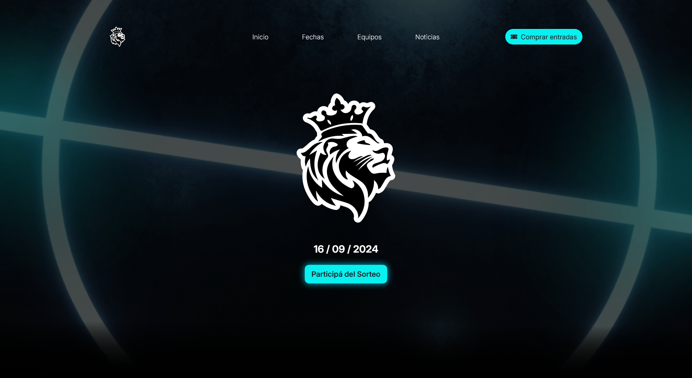
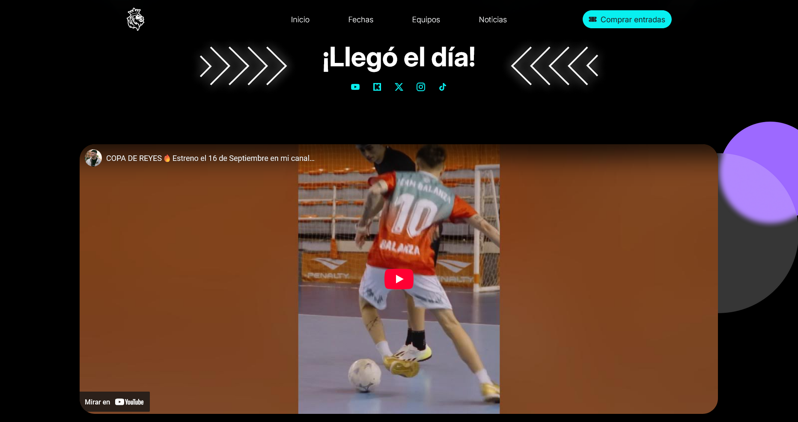
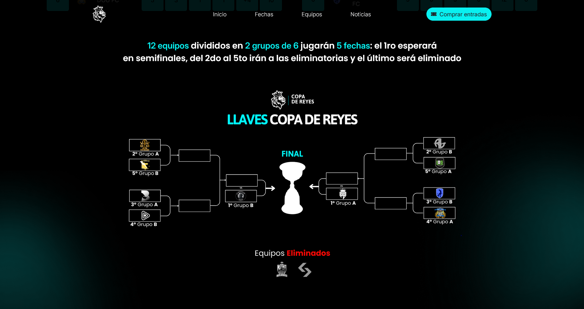
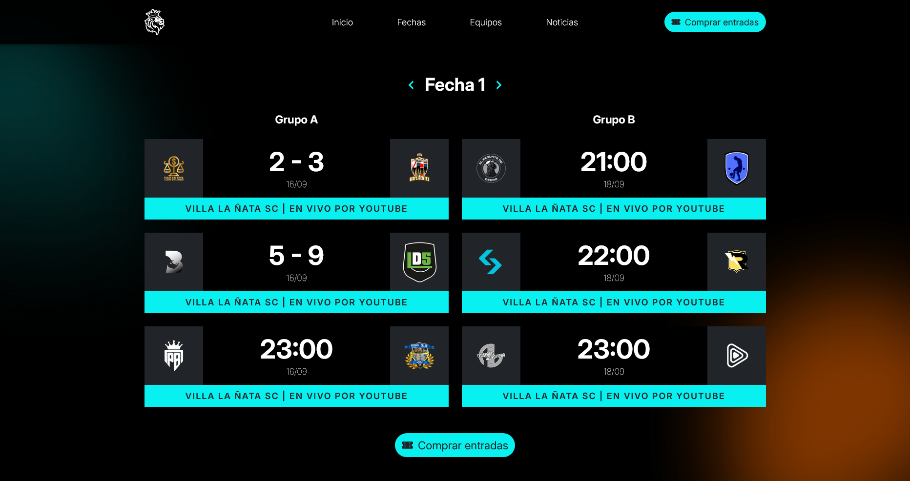

Desarrollé la landing oficial del evento de futsal “Copa de Reyes”, realizado en Argentina (en el predio del Club Sporting de [Villa la Ñata](https://maps.app.goo.gl/js1qhixJ8tHA1qt59)), con métricas en tiempo real, tablas de clasificación y llaves eliminatorias. El sitio se mantuvo disponible sin caídas durante todo el torneo, incluso con picos altos de tráfico.

### ✨ Funcionalidades Principales

- Visualización de próximas fechas, resultados y estadísticas
- Llaves de eliminación directa y fase de grupos
- Tablas de clasificación con rendimiento por equipo
- Backend robusto con Spring Boot y PostgreSQL
- Despliegue dockerizado y hosting con alta disponibilidad (99.9%)

### 🖼️ Capturas

- Inicio - Hero Section

- Timer

- Timer y Trailer

- Tablas 

- Llaves

- Fechas

### 📈 Impacto

- Venta de entradas a través de [Passline](https://web.archive.org/web/20240910012912/https://www.passline.com/sitio/copadereyes)
- Evento patrocinado por [Bitget](https://www.bitget.com/es/)
- Promoción del evento en redes sociales con +38.5K seguidores en Instagram, +22.7K en TikTok (662K likes)
- Transmisión por YouTube (+500K suscriptores), con gran tráfico concurrente al sitio
- Sitio accesible y estable incluso durante picos de visitas

### 🚀 Tecnologías utilizadas

- Java Spring Boot
- JDBC, JPA, Hibernate
- Thymeleaf
- PostgreSQL
- Docker
- Hostinger

### 📌 ¿Para qué lo hice?

Proyecto freelance para un torneo deportivo en crecimiento, con el objetivo de mostrar resultados, estadísticas y fichas de equipos en tiempo real para el público general. Permitió poner en práctica buenas prácticas de backend, despliegue y performance bajo demanda, todo en un entorno real con exposición masiva.